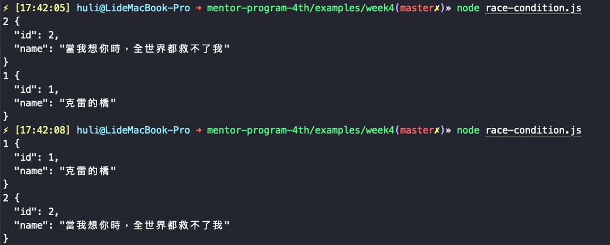

# Week4 作業自我檢討

本週範例請參考其他檔案

## race condition

（這一段要講的觀念超級無敵重要，不懂的話請在 slack 提問）

請問底下程式碼的輸出會是什麼？  
（程式碼在 `./race-condition.js`）

``` js
const request = require('request');
const API_ENDPOINT = 'https://lidemy-book-store.herokuapp.com';

request(`${API_ENDPOINT}/books/1`, (err, res, body) => {
  console.log('1', body)
})

request(`${API_ENDPOINT}/books/2`, (err, res, body) => {
  console.log('2', body)
})
```

> 很簡單啊，不就是先輸出 id 是 1 的內容，再輸出 2 嗎？

不是這樣的。

這一題的答案是：不一定。你可以自己執行個幾遍，應該就能夠像我一樣試出來：



有可能會先 1 再 2，也有可能會先 2 再 1。

這一切都跟非同步有關。

在上面提供的範例中，可能對結果的影響沒那麼大，就是順序亂掉而已，所以考慮一個比較實際的例子可能會更容易理解。

假設我們有一個「留言板」的 API，有兩個方法可以用，一個是新增留言，一個是抓取所有留言。我們想在新增留言完以後，重新抓取所有留言，很多人可能就會這樣寫：

``` js
const request = require('request');

// 新增留言
request.post({
  url: 'https://example.com/api/messages',
  form: { content: '新留言' }
}, (err, res) => {
  console.log('新增成功！');
})

// 抓取所有留言
request('https://example.com/api/messages', (err, res, body) => {
  console.log('所有留言：', body)
})
```

那結果會是什麼？

> 我先新增留言，再抓取留言，這樣應該沒什麼問題吧？

不，問題可大了。

你第一個 Request 先發歸先發，但「先發不代表會先到達」，這點超級重要。所以兩個 Request 如果第二個先到了，那你拿到的就還是舊的留言。

再來，儘管第一個先到，但你其實是「立刻」就發了第二個 Request，兩個相差的時間可能只有 1ms 而已，這根本不是什麼差距。而 Server 處理第一個新增留言的時間很有可能大於這個差距，因此你新增了留言沒錯，但你第二個 Request 拿到的東西依然是舊的。

簡單來說好了，「從你電腦發 Request 到 Server 的時間」跟「Server 的處理時間」以及「從 Server 發 Response 傳到你電腦的時間」這三者都是「無法估計」的，所以什麼事都有可能發生，有可能快有可能慢。

所以上面那段程式碼就會有 bug 出現。

這邊改寫一下助教 yakim 寫的平易近人的[解釋](https://github.com/Lidemy/mentor-program-4th-YSKuo/pull/4#discussion_r449785907)：

======

要理解為何有這隱藏的 bug，最簡單的理解是先把發送 request 假想成在美式餐廳點餐的動作：

``` js
order('一份洋蔥圈')
order('一份漢堡')
```

我先後發送了兩個 order，而餐點送來的順序就會是 洋蔥圈 => 漢堡 嗎？ 不一定吧！可能會跟廚房做菜的習慣或各種原因都會影響到送餐順序。

而發送一個 request 也是如此，假設我照順序發了三個 request a, b, c，沒有人可以保證 response 回傳的順序也是 a, b, c

======

接下來我們直接假設幾種狀況就好。

### 狀況一

1. 先發第一個 request，並且第一個 request 先抵達
2. 第二個 request 抵達 server 的時候，第一個 request 已經處理完成並且傳回 response
3. 第二個 response 抵達

這是你原本心裡所想的情況，也是最理想的狀況。

這種情況的話，會在新增完留言之後才抓取留言列表，所以拿到的會是最新的列表，有你剛剛新增的留言。

### 狀況二

1. 先發第一個 request，並且第一個 request 先抵達
2. 第二個 request 抵達 server 的時候，第一個 request 還在處理
3. 回傳第二個 response，拿到當下的留言
4. 留言新增完成

在這種情形下，因為第二個 response 處理的時候，你其實是還沒有新增留言的，因此拿到的結果會是舊的，不會有你剛剛新增的留言。

除了以上兩種，還可以再假設超級多種，而且每一種情況都有可能發生。

例如說第一個 request 不知道為什麼塞住了，所以你發出去以後，過了 5 秒才抵達 server。可是第二個 request 異常地快，發出去以後 1 秒就到 server 了。所以對 server 來說，你其實是「先抓取所有留言，才新增留言」。

或是再舉一個例子，我這樣寫：

``` js
for(let i=1; i<=5; i++) {
  request('https://example.com/api/messages/'+ i, (err, res, body) => {
    console.log(`第${i}個留言`, body);
  })
}
```

其實就是拿第一篇到第五篇文章的內容，那請問我最後 log 出來的結果會是什麼？

12345 嗎？

不是，結果是我不知道。

有可能是 12345，也有可能是 54321，甚至是 13542，每一種排列組合都有可能。

原因就是我上面講過的：「從你電腦發 Request 到 Server 的時間」跟「Server 的處理時間」以及「從 Server 發 Response 傳到你電腦的時間」這三者都是「無法估計」的。

所以如果我拿出下面這段程式碼：

``` js
const request = require('request');

// 新增留言
request.post({
  url: 'https://example.com/api/messages',
  form: { content: '新留言' }
}, (err, res) => {
  console.log('新增成功！');
})

// 抓取所有留言
request('https://example.com/api/messages', (err, res, body) => {
  console.log('所有留言：', body)
})
```

問你說結果會是什麼，答案是：「不知道」。

這種情況就叫做 race condition，最後的產出完全憑當下他們競爭的結果，你在事前無法預料結果是什麼。你有可能先新增留言，也有可能先拿到結果，每一種都有可能，所以結果變得無法預期。

所以這種情況當然要避免。

那怎麼避免？最好的方法當然就是：「確保第一個 request 處理完成時，我才發送第二個 request」。

那我怎樣才知道第一個處理完了？當然就是從我拿到第一個的 response 的時候，我自然就知道第一個處理完了，不然我不可能拿得到 response 嘛。

所以呢，你要這樣寫才是對的，確保新增留言成功，再去抓取留言：

``` js
const request = require('request');

// 新增留言
request.post({
  url: 'https://example.com/api/messages',
  form: { title: '新留言' }
}, (err, res) => {
  console.log('新增成功！');

  // 確保新增成功，才去抓取所有留言
  request('https://example.com/api/messages', (err, res, body) => {
    console.log('所有留言：', body)
  })
})
```

這樣是唯一能保證順序的方法。

之前還有看過同學偷吃步：

``` js
// 新增留言
request.post({
  url: 'https://example.com/api/messages',
  form: { title: '新留言' }
}, (err, res) => {
  console.log('新增成功！');
})

setTimeout(() => {
  request('https://example.com/api/messages', (err, res, body) => {
    console.log('所有留言：', body)
  })
}, 1500) // 等個 1.5 秒
```

但這樣依然無法保證結果是正確的，因為我們可以假設第一個 request 處理完成時已經超過 1.5 秒了（而且這完全有可能發生），這樣你拿到的文章列表依然還是錯的。

牽扯的網路的東西都是非同步的，而非同步就代表著順序是無法被預知的。你只能靠著自己寫 code 來掌握正確的順序。

這個觀念超級無敵重要，請大家務必要知道～

有問題記得在 slack 或是 spectrum 上面提問。

## JSON.parse

我有看到很多人在程式碼裡面一拿到資料就直接對 response 做 `JSON.parse`，但若是 response 不是一個合法的 JSON 字串，會回傳錯誤：

``` js
let str = '[123'
let json = JSON.parse(str)
// VM174:1 Uncaught SyntaxError: Unexpected end of JSON input
``` 

所以最完善的做法其實是加個 try catch：

``` js
let json;
try {
  json = JSON.parse(str)
} catch(e) {
  console.log(e) // 錯誤處理
}
```

這樣就可以確保錯誤有被處理到。不過在參考解答裡面也沒有加就是了，代表參考解答還有改進空間，這點就留給大家去改進了XD

然後大家千萬不要搞混「JSON 格式的字串」跟 JavaScript Object 這兩個東西了。當你利用 xhr 拿到 response 的時候，它一定是一個字串，請大家記住這一點。

在我們串接 API 的時候，它除了是字串以外，還是一個「JSON 格式的字串」，這是什麼意思呢？

``` js
const obj = {
  a: 1
}
```

obj 是一個 JS 的物件對吧？當我們想要把一個 JS 的物件變成「JSON 格式的字串」時，可以利用 `JSON.stringify` 這個方法：

``` js
const obj = {
  a: 1
}
console.log(JSON.stringify(obj))
/*
  {"a":1}
*/
```

所以 `{"a":1}` 就是一個 JSON 格式的「字串」，那要怎麼把這個字串變回 JS 物件？沒錯，就是 `JSON.parse`：

``` js
const jsonString = '{"a":1}'
console.log(JSON.parse(jsonString))
/*
  {a: 1} // JS 物件，不是字串
*/
```

你在 log 出來的時候就可以在 devtool 上面看出這是一個「字串」還是一個「物件」，這點絕對要分清楚。所以為什麼我們每次把結果接回來以後都要用 `JSON.parse`？因為 xhr 回傳的 response 內容是純文字，是字串，所以要用 `JSON.parse` 把字串變成 JS 物件，我們才能操作。

## 迴圈的次數

這週的作業第一題是要大家列出前十筆資料，有很多人拿到資料以後這樣子寫：

``` js
for (let i = 0; i < 10; i += 1) {
  console.log(`${data[i].id} ${data[i].name}`);
}
```

這是不對的。

第一，API 有提供一個參數叫做 `_limit`，你應該要用這個參數，而不是自己把資料抓下來以後才去取 10 個。這樣會有什麼問題呢？假設 API 回傳 100 筆資料，那你其他 90 筆不就白抓了？所以請愛用 API 提供的參數。

第二，API 有可能回傳比十筆更少的資料（例如說資料就只有五筆，那 API 怎麼會回傳十筆？），所以在這個時候，請相信你的 API，加了 `_limit=10` 的參數以後，直接把後端回傳的資料印出來就好：

``` js
for (let i = 0; i < data.length; i += 1) {
  console.log(`${data[i].id} ${data[i].name}`);
}
```

這樣就能保證印出的東西是正確的了，儘管資料沒有十筆也不會有問題。

這時候你可能會問說：「那如果 API 不小心回傳 13 筆怎麼辦？」

那就代表 API 有問題，是後端 API 那邊需要修正，而不是前端這邊需要修正。以這一週串的 API 來說，當我們傳 `_limit=10` 的時候，API 就應該回傳至多十筆資料。

## status code

我看到有很多人都會把 status code 直接寫死：

``` js
if (response.statusCode === 200) {
  //...
}
```

但這也是有問題的。

如果你還記得的話，2 開頭的 status code 都是代表成功的意思。所以哪天 API 的 status code 如果從 200 變成 201，你的程式就掛了，就會誤判為不成功，但其實是成功的。

所以你在查資料的時候，應該會看到很多人這樣子寫：

``` js
if (response.statusCode >= 200 && response.statusCode < 300) {
  //...
}
```

應該判斷 status code 在 2XX 這個範圍裡面，而不是寫死只判斷 200，這樣才是比較好的方法。

## 變數跟函式命名

在 JS 裡面命名變數或是函式時，一般來說都會用駝峰式命名法，詳情可以自己去查一下
或是可以在 eslint 把這個規則打開：https://eslint.org/docs/rules/camelcase 。

這一篇寫得不錯，大家可以參考一下：https://juejin.im/entry/599d433cf265da24797b5c66

然後命名盡量取得有意義一點，什麼 `a`、`b` 這種取名就不必了（除非你剛好在做一個 add 的函數，那這樣是可以的）。想要練習這塊可以多看別人的 code，看看別人怎麼命名。

## process.argv 補充

看到有些同學卡在 process.argv 的使用，幫大家稍微再講解一下。argv 的全名應該是 `argument variables`，簡單來講就是參數。

那是什麼的參數呢？

除了 function 可以傳參數以外，你在打指令的時候也可以下參數  
舉例來說：`git commit -am "test"`  
`git` 是你要呼叫的程式本身，後面的 `commit -am "test"`都是參數  
在 Node.js 裡面，就提供給我們 `process.argv` 來拿使用者下的參數

實際內容是什麼呢？我們來觀察一下  
我開一個檔案叫做 a.js，內容只有一行：`console.log(process.argv)`  
然後我下指令：`node a.js read 999`，log 出來的內容是：  

```
[
  '/Users/huli/.nvm/versions/node/v12.2.0/bin/node',
  '/Users/huli/Documents/lidemy/demo/a.js',
  'read',
  '999'
]
```

仔細看就會發現其實就是你指令的每一個用空白隔開的部分  
差別只在於這邊幫你把絕對路徑給加上去了

總之呢，process.argv 其實就是拿到你在打指令時候的每一個部分而已  
因為第四週作業你一定是下 `node a.js xxxx`，所以你才會看到大家都從 `process.argv[2]` 開始拿

`process.argv[0]` 會是 node 的位置，`process.argv[1]` 會是 a.js 的位置，所以才會從 2 開始拿  

它就是個陣列而已，別想的太複雜了。


