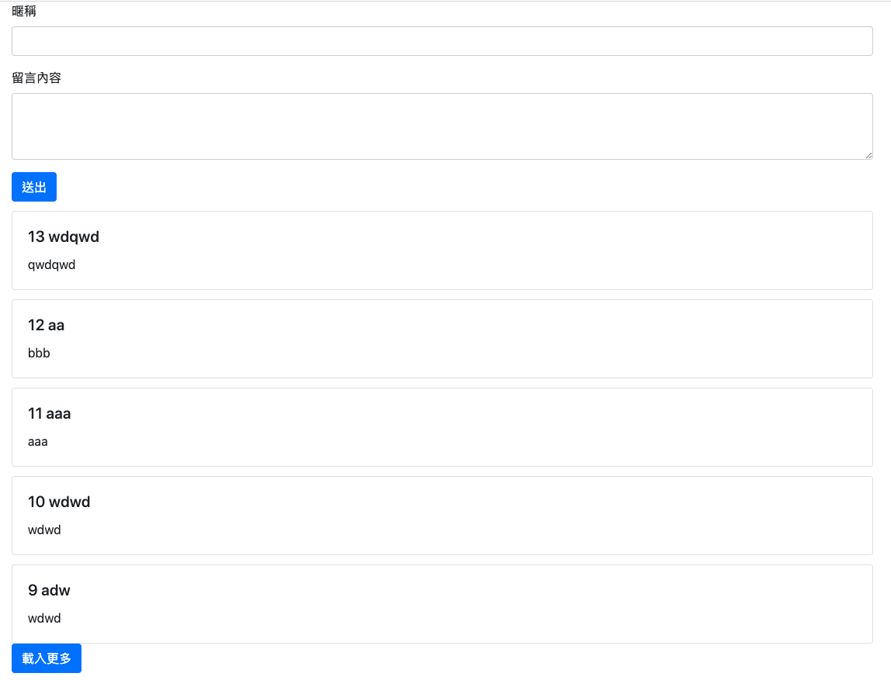
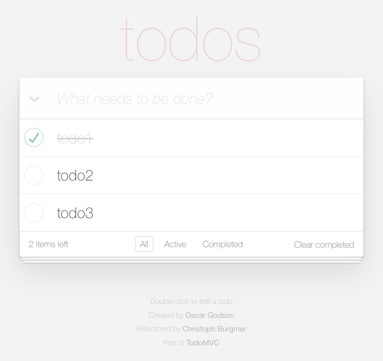

# 作業

## hw1：增強版 JavaScript 留言板

之前在 BE101 的最後，有做了一個留言板的 API，並且自己利用前端 JS 去串接，有顯示留言跟新增留言這兩個功能，如果你忘記的話可以回去複習一下（真正的實戰：留言板 - API 篇）。

而這一週的第一個作業會由我帶著你做，我們會做出：

1. 留言板的 API，能夠新增留言以及顯示留言
2. 寫一個前端頁面，串接自己寫的 API

帶你做的影片請參考 MTR04 這堂課程。

~~帶你做完以後，你要自己從頭實作一遍並且加上一個新功能：分頁。~~

~~留言板每一頁最多顯示 5 個留言，網站最底下需要顯示分頁，要能夠顯示現在在哪一頁、總共有幾頁還有前往上一頁跟下一頁的功能。~~

接著是這一週你要自己實作的新功能。

原本要讓大家實作分頁功能，所以你在影片中可能會看到上面舊的作業敘述。

但後來我想了一下，改做：「載入更多」的功能就好。  

如果留言大於 5 筆的話，下面會出現「載入更多」的按鈕，按下去就會載入新的 5 筆留言。因為留言是從新排到舊，所以越下面的留言會越舊。當沒有更多留言可以載入時，就不會出現載入更多的按鈕。

介面的部分請盡量使用 Bootstrap，JS 的部分也請盡量用 jQuery，版面可以隨自己的喜好調整。

  
提示 #1

  
  在實作以前可以搜尋關鍵字：「cursor based pagination」，或者是參考底下資料：

1. [API做翻页的两种思路](https://www.cnblogs.com/cgzl/p/10706881.html)
2. [How to do Pagination?](https://b96016.gitlab.io/post/how-to-pagination/)
3. [Pagination with Relative Cursors](https://engineering.shopify.com/blogs/engineering/pagination-relative-cursors)

## hw2：Todo List

之前在第七週的時候有實作過一個 todo list，那時只有支援新增、刪除已經標記完成，但比較完整的 todo list 應該會長這個樣子：

參考連結：http://todomvc.com/examples/vanillajs/

需要支援的功能有：

1. 新增 todo
2. 編輯 todo
3. 刪除 todo
4. 標記完成/未完成
5. 清空 todo
6. 篩選 todo（全部、未完成、已完成）

以上的東西都是純前端的，跟後端完全沒有任何關係。

接著的這個功能才跟後端有關，那就是那就是會有一個「儲存」的按鈕，按下去以後會把目前 todo 的狀態送到 server 去儲存，並且回傳一個獨特的 id，以後使用者如果有帶這個 id，就自動把它的 todo 載入進來。

舉例來說，原本的網址可能是`https://example.com/todos.php`，按下儲存以後網址變成：`https://example.com/todos.php?id=5`，下次我用同樣網址進來時，就可以看到我之前儲存好的 todo item。

這邊一樣是前後端串接，你必須要用 ajax 來傳遞資料。所以你要思考的問題是：

1. 怎麼把 todo 的狀態變成字串傳到 server
2. 怎麼樣偵測網址上的 id，並且送出 request 到後端抓取 todos
3. 怎麼樣把 todos 顯示在前端

介面的部分請盡量使用 Bootstrap，JS 的部分也請盡量用 jQuery，版面隨自己喜好設置就可以了，不需要跟上面那個圖片長得一樣（請不要因為要把版面弄得好看或是要跟圖片一樣而花太多時間，這個作業的重點在於功能而不是版面）。

（如果你沒什麼時間或是覺得這個有夠難做，也可以只做前端的 todo list 就好，不需要做後端的部分）

  
提示 #1

  
  你可能會思考說要怎麼把 todos 的狀態存起來，其實你只要在前端用 JSON.stringify，把 todos 變成一個 JSON 字串送到後端存起來就好。

  要恢復時就可以從後端拿資料，JSON.parse 之後你就有了 todos 的狀態。

## hw3：簡答題

1. 請簡單解釋什麼是 Single Page Application
2. SPA 的優缺點為何
3. 這週這種後端負責提供只輸出資料的 API，前端一律都用 Ajax 串接的寫法，跟之前透過 PHP 直接輸出內容的留言板有什麼不同？

請將答案寫在 [hw3.md](hw3.md)。
