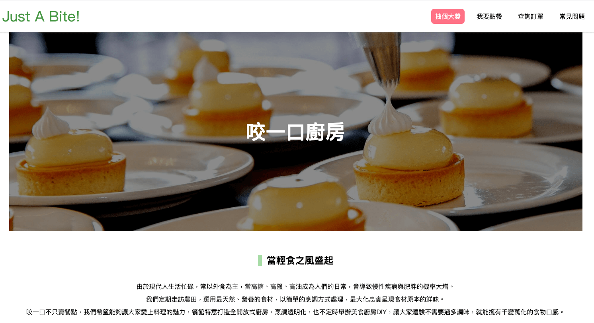
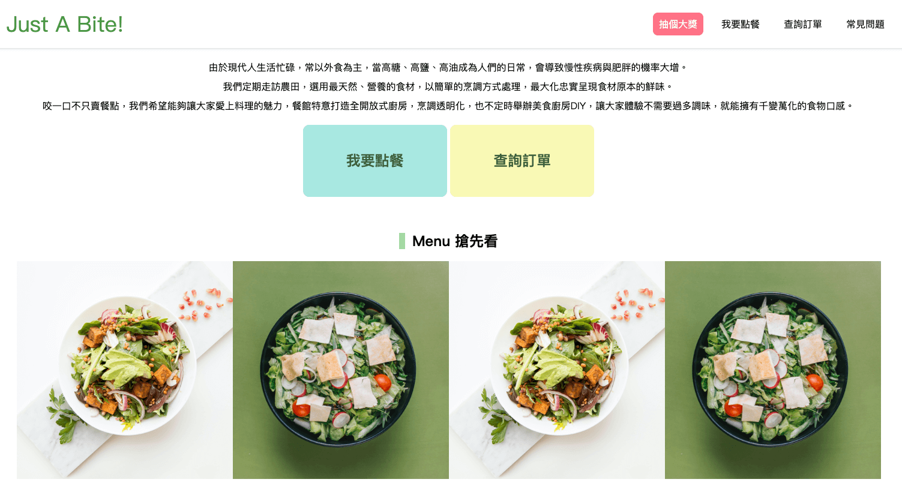
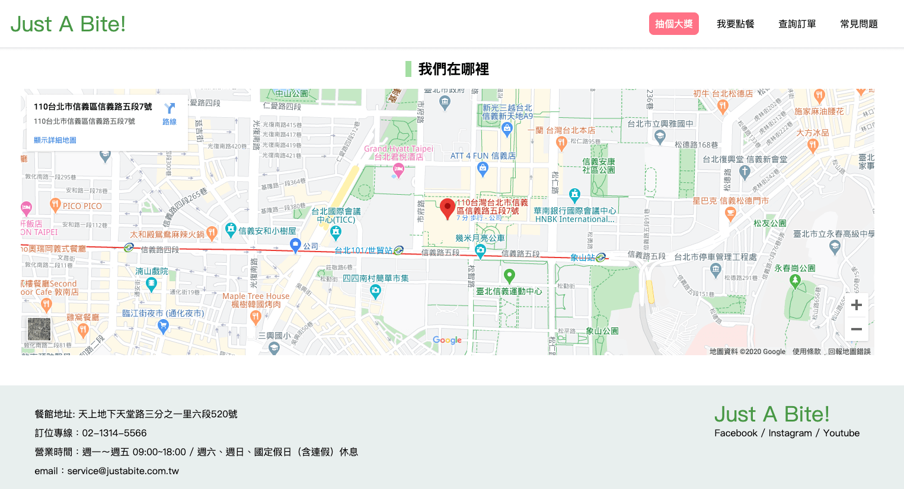
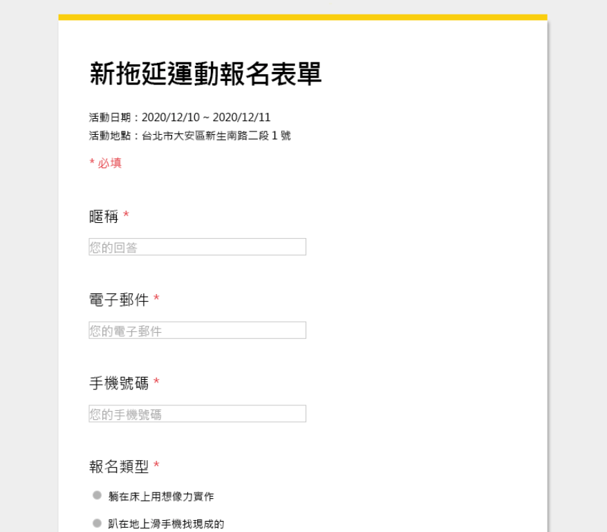

# 作業

## hw1：餐廳頁面

圖片參考：

設計稿：https://app.zeplin.io/project/5eab7fd61be0341bdeed0db0/screen/5eab888623964b1b1214a9d3

（目前權限僅供公開給第四期學生，如果第四期學生發現沒有權限請找 @huli）

這個作業屬於「跟著教學動手做」的作業，目的是強迫你跟著影片練習一次，觀察一下我的切法以及讓你對切版更熟練。

因此，請根據這一週切版教學裡面的步驟，切出這個餐廳頁面。

然後你會在設計稿裡面發現一個「網友評論」的區塊，並沒有在切版教學影片裡面出現，這就是要留給大家自己實作的地方，RWD 的部分可以自行發揮。

## hw2：活動報名表單

圖片參考：

設計稿：https://app.zeplin.io/project/5eab7fd61be0341bdeed0db0/screen/5eb779c00efe004a516fe796

（目前權限僅供公開給第四期學生，如果第四期學生發現沒有權限請找 @huli）

請根據範例，切出一個活動的報名表單，並且要支援 RWD，RWD 要長什麼樣子請自行發揮。

這個作業屬於「自己動手做」的作業，目的是讓你自己從無到有實作出一個東西。可以抱持著「先求有，再求好」的心態來進行。例如說先切桌面版，然後版面不符的地方就先放著，至少先把內容跟基本版面弄好，接著再來微調，然後再來調整手機版的版面。

## hw3：簡答題

請將答案寫在 [hw3.md](hw3.md)。

1. 請找出三個課程裡面沒提到的 HTML 標籤並一一說明作用。
2. 請問什麼是盒模型（box modal）？
3. 請問 display: inline, block 跟 inline-block 的差別是什麼？什麼時機點會用到？
4. 請問 position: static, relative, absolute 跟 fixed 的差別是什麼？分別各舉一個會用到的場合

## 挑戰題

[Hacker News](https://news.ycombinator.com/) 是一個很知名的網站，上面有著各種與科技相關的資訊。現在請你看著這個網站，把它切出來。

或是如果你想把它變得更美，也可以試試看。

## 超級挑戰題

打開你的 Facebook，看著它。

打開你的文字編輯器，開始依樣畫葫蘆，切出一個 Facebook。

你只要切出你現在看得到的版面就好，不用考慮往下滑什麼的。但如果你切完還是心有餘力，那也可以試試看。
