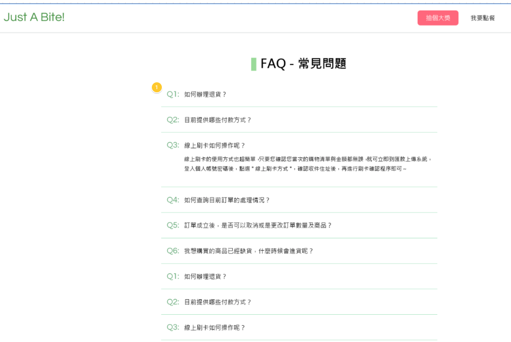
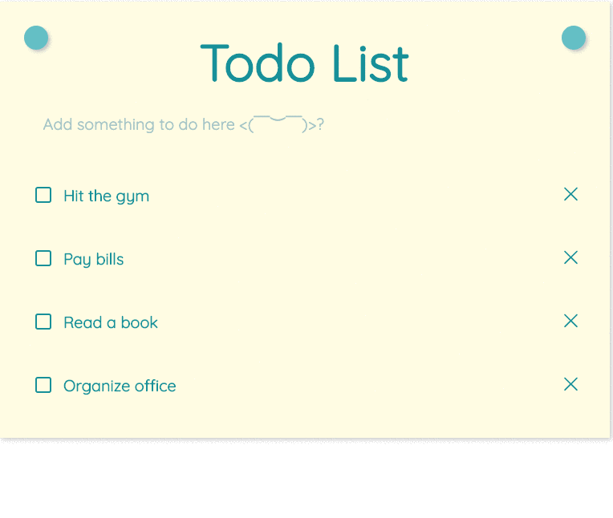

# 作業

## hw1：表單驗證

圖片範例：

（版面已經在上一週做好了，所以這一週不用重新切版）

還記得上一週裡面做的活動報名表單嗎？這一週要來幫報名表單加上驗證，在表單送出的時候會針對以下幾個欄位做檢查：

1. 暱稱是否為空
2. 電子郵件是否為空
3. 手機號碼是否為空
4. 報名類型是否有勾選
5. 怎麼知道這個活動的是否為空

如果沒有通過檢查，請在欄位的 input 下方顯示紅字提醒，有通過的話跳出一個 alert 展示使用者填寫的資料。

## hw2：餐廳 FAQ 頁面

圖片範例：

設計稿：https://app.zeplin.io/project/5eab7fd61be0341bdeed0db0/screen/5eabfdb4c6cf53190a8a37db

上一週的作業裡面，我們完成了餐廳的首頁，接下來要幫他加上一個常見問題的頁面，回答一些常見問題。

在這頁面上會出現許多常見問題，點開之後就能夠看到回答。現在要實作的就是這個頁面以及「點開後展開答案」的功能。上面的字你可以隨便亂寫隨便亂找，或是直接找個購物網站之類的來參考。

請注意，這一題為第六週的延伸作業，所以你大部分的版面跟 CSS 其實都可以重新利用，可以直接複製過來，這樣就只需要做 FAQ 的部分。

## hw3：Todo List

範例（來自第三期同學 shuanshuan030913 的[作業](https://lidemy.github.io/mentor-program-3rd-shuanshuan030913/homeworks/week13/hw2/)）：

Todo List 是一個很經典的範例，之所以這麼經典就是因為可以完整的學習到如何實作出新增、刪除、編輯以及篩選等等的功能，但大家還只是初學者，所以我們並沒有要做出所有功能。

這一個作業要讓大家實作出基本的 todo list，功能包括：

1. 可以新增 todo
2. 可以刪除 todo
3. 可以標記 todo 為完成/未完成

介面可以參考範例也可以自己想，重點是功能要做出來。

## hw4：簡答題

1. 什麼是 DOM？
2. 事件傳遞機制的順序是什麼；什麼是冒泡，什麼又是捕獲？
3. 什麼是 event delegation，為什麼我們需要它？
4. `event.preventDefault()` 跟 `event.stopPropagation()` 差在哪裡，可以舉個範例嗎？

請將答案寫在 [hw4.md](hw4.md)。

## 挑戰題

參考 Bootstrap，實作出一個 Carousel 元件，可參考：https://getbootstrap.com/docs/4.3/components/carousel/#with-captions

備註：只能使用 HTML、CSS 與 JavaScript，禁止使用任何套件

