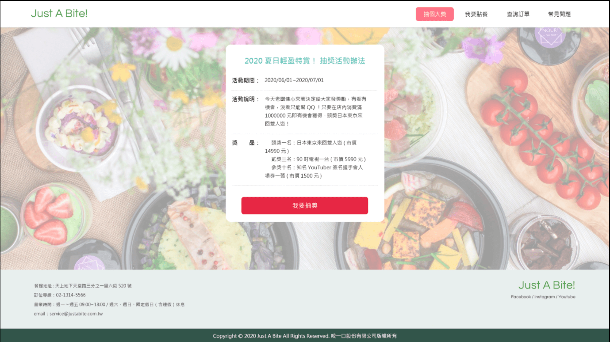
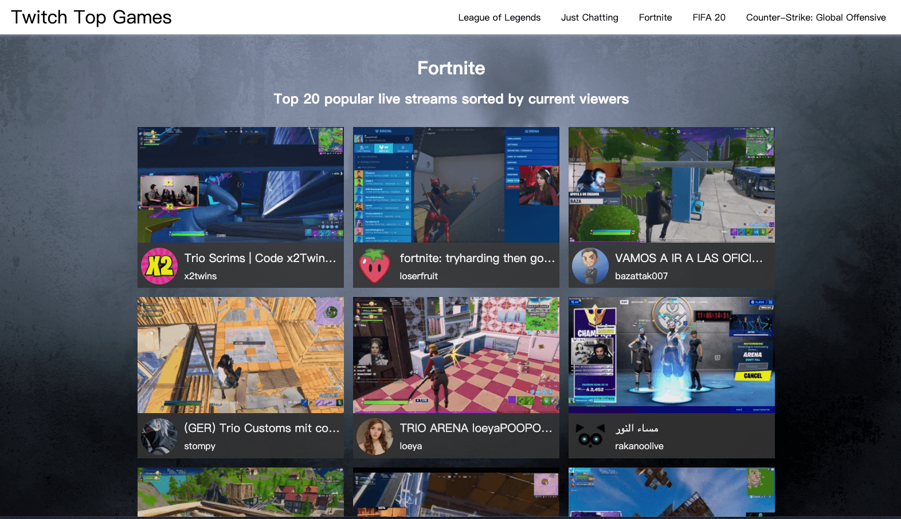
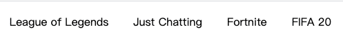
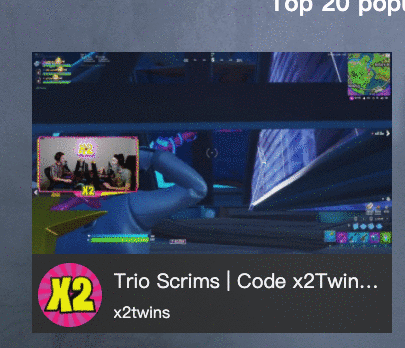

# 作業

## hw1：餐廳抽獎活動

圖片範例：




設計稿：

1. https://app.zeplin.io/project/5eab7fd61be0341bdeed0db0/screen/5eaba473e21be61d702230b2
2. https://app.zeplin.io/project/5eab7fd61be0341bdeed0db0/screen/5eabf815ce89761c108bbdfc

之前幫忙做的餐廳網站要推出新的活動了，老闆已經委託一間公司寫好了抽獎的 API，而你要幫忙的地方是實作前端介面並且跟 API 串接，這樣子就是一個完整的抽獎活動頁面了！

這是 API 的網址：https://dvwhnbka7d.execute-api.us-east-1.amazonaws.com/default/lottery

用 GET 即可，API 會回傳一個 JSON 格式的物件，內容為：

```
{
  prize: "獎項名稱"
}
```

API 會按照機率回傳不同的獎項名稱，請你針對不同的獎項名稱做處理。

獎項名稱一共有四種：FIRST、SECOND、THIRD 以及 NONE。

1. FIRST，頭獎，在網頁上顯示字樣：「恭喜你中頭獎了！日本東京來回雙人遊！」，並且把背景改成[這張圖片](https://pixabay.com/photos/flight-plane-close-look-airplane-4315953/)。
2. SECOND，二獎，在網頁上顯示字樣：「二獎！90 吋電視一台！」，並且把背景換成[這張圖片](https://pixabay.com/photos/living-room-tv-table-a-drawer-home-1872192/)。
3. THIRD，三獎，在網頁上顯示字樣：「恭喜你抽中三獎：知名 YouTuber 簽名握手會入場券一張，bang！」，並且在網頁上放[這張圖片](https://pixabay.com/photos/youtube-iphone-smartphone-mobile-2617510/)。
4. NONE，銘謝惠顧，在網頁上顯示字樣：「銘謝惠顧」，並且把圖片的部分變成黑底，文字顏色變成白色。

有一點要特別注意，API 偶爾可能會不太穩定，會回傳錯誤。如果發生任何預期之外的情形（回傳的獎項不是以上四種，或是 Server 直接回傳錯誤），請跳出提示視窗（alert）：「系統不穩定，請再試一次」。

這也是第六週的延伸，所以版面跟大多數部分都可以重新使用，直接複製貼上改一改就好。

### 進階挑戰題

請問這四種獎項的機率為何？

## hw2：再戰 Twitch API



還記得之前你幫果凍做的小程式嗎？可以看到 Twitch 上面熱門的遊戲，讓他從中挑選一個並且直播。這個成效很不錯，但是身為一個實況主，他又面臨了新的挑戰。

最近又太多太多實況主了，每個都有不同的特色，除了精進自己的實力以外，也要觀察一下競爭對手在做什麼。於是，他想拜託你寫一個網頁，可以顯示出某個特定遊戲的一些熱門實況，好讓他能夠方便觀察競爭對手。

請串接 [Twitch API](https://dev.twitch.tv/docs/v5)，顯示出目前最熱門的 5 個遊戲，點下去之後可以顯示正在直播這遊戲的前 20 個實況（要剛好 20 個）。可以切換不同的遊戲，顯示不同遊戲的熱門實況。

如果你做完還有時間的話，可以加一些 transition 的效果，例如說：



以及



<details>
  <summary>提示 #1</summary>

  [Twitch API](https://dev.twitch.tv/docs/v5/) 裡面有一個 API 可以拿到 Live Streams 的資料，API 的描述是「Gets a list of live streams.」，看到這行就代表你找對 API 了。
</details>

<details>
  <summary>提示 #2</summary>

  API 要帶的參數有一個 `game` 的欄位，請帶遊戲名稱，還有要記得帶 limit 這個參數
</details>

附註：Twitch API 有兩個版本，v5 是舊版，這個作業跟第四週一樣，用的會是**舊版**，請特別留意


## 進階挑戰題

這個頁面最底下加上一個按鈕：「載入更多」，點了之後會繼續載入之後的 20 個實況。按鈕不會消失，除非已經沒有更多的實況可以載入了。

## hw3：簡答題

1. 什麼是 Ajax？
2. 用 Ajax 與我們用表單送出資料的差別在哪？
3. JSONP 是什麼？
4. 要如何存取跨網域的 API？
5. 為什麼我們在第四週時沒碰到跨網域的問題，這週（觀看 JS102 影片的時候）卻碰到了？

請將答案寫在 [hw3.md](hw3.md)。
