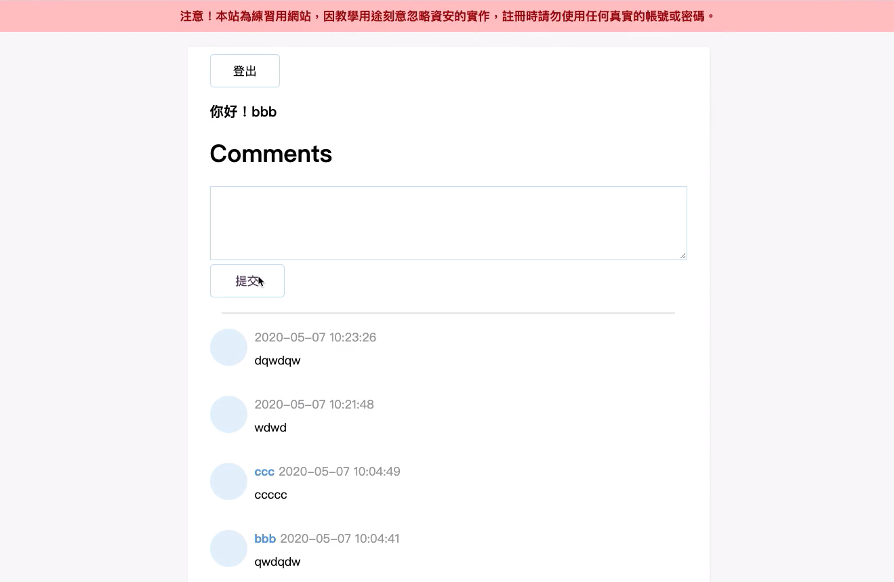

# 作業

## hw1：留言板

這一週大家才剛接觸 PHP 而已，一定會需要一段時間才能上手，所以這週的作業會比較輕鬆，留多一點時間讓大家來練習。

在 [BE101] 用 PHP 與 MySQL 學習後端基礎這堂課裡面有一系列的教學，其中有一部分「真正的實戰：留言板」，會一步步教大家如何寫出一個留言板，並且逐漸改善它。

請跟著影片動手做並且看到「PHP 內建 session 機制」的單元，並且自己親手把留言板給做出來。第一次做的時候你可以邊跟著影片邊打程式碼，寫完之後自己再看一遍。如果做一次不夠，你可以做很多次。

這週的作業理想上的程度是：「刪掉全部程式碼重來，你有辦法從零開始自己把留言板寫出來（可以查資料但不能看我寫的範例）」，做到這樣你就通過這週作業的標準了。

## hw2：簡答題

1. 資料庫欄位型態 VARCHAR 跟 TEXT 的差別是什麼
2. Cookie 是什麼？在 HTTP 這一層要怎麼設定 Cookie，瀏覽器又是怎麼把 Cookie 帶去 Server 的？
3. 我們本週實作的留言板，你能夠想到什麼潛在的問題嗎？

請將答案寫在 [hw2.md](hw2.md)。
